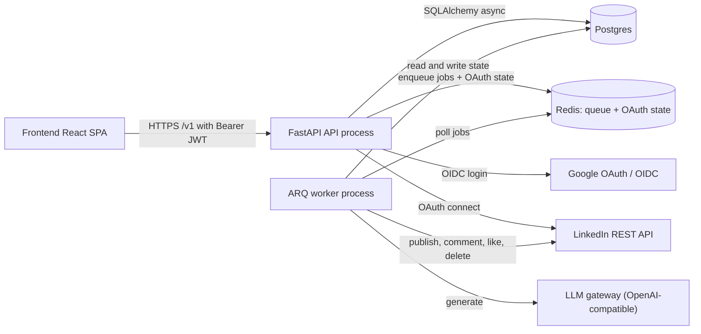
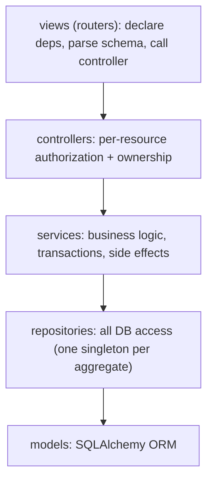
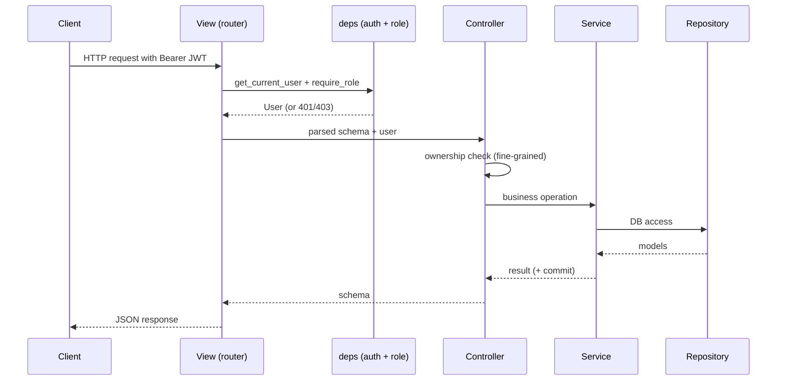
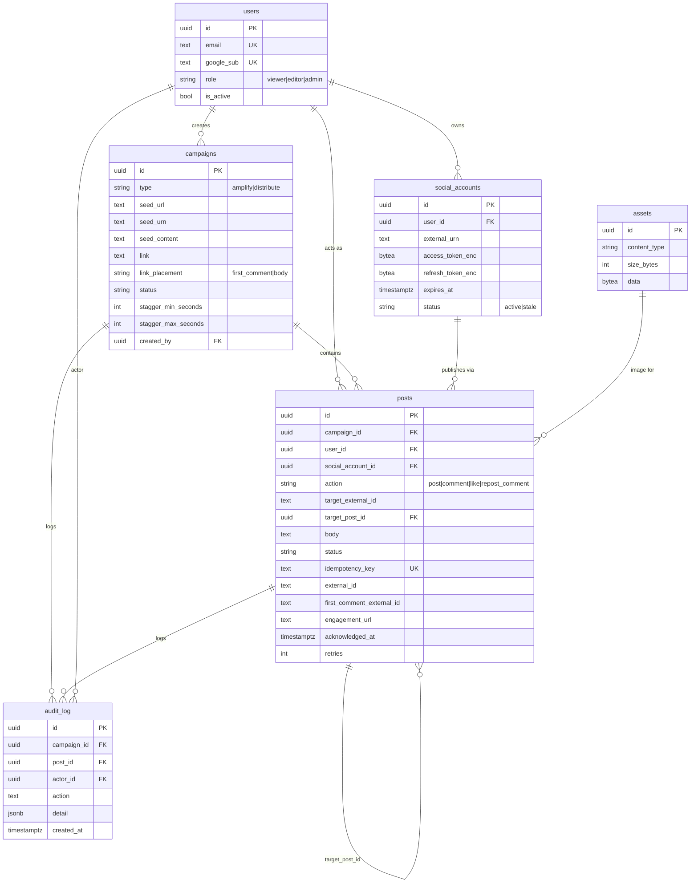
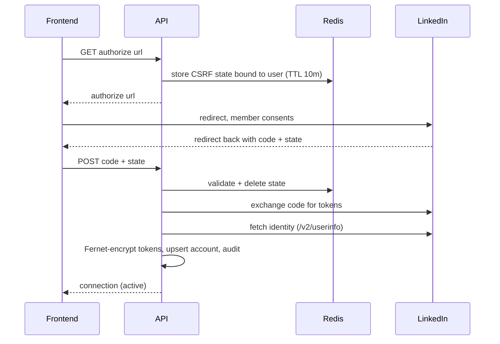
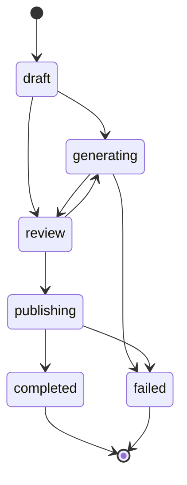
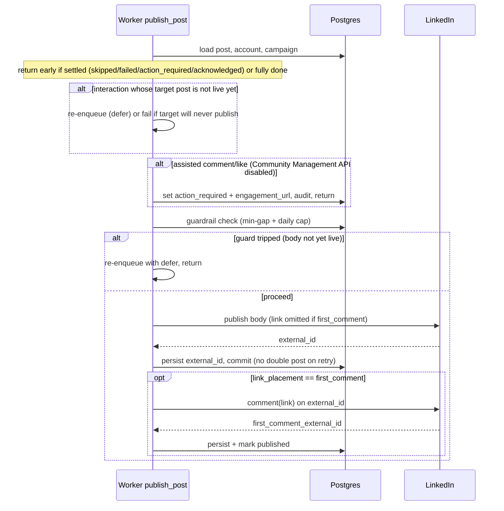

# Architecture

This document describes the super-hype backend as it stands today: the runtime
topology, the layered code structure, the data model, the auth and connection
flows, the campaign lifecycle, the generation subsystem, and the ARQ publishing
pipeline (including the link-in-first-comment sequence and the authenticity
guardrails). It is meant to be a single, accurate reference for onboarding and
for building future presentations.

`DESIGN.md` is the original system overview and `BACKEND.md` is the backend spec.
Where this document and those disagree, this one reflects the code as written.

## 1. Overview

super-hype is an internal employee-advocacy tool. Employees connect their own
LinkedIn account, then a small GTM team runs coordinated, consented pushes around
a post. There are two campaign types:

- Amplify (1 x N): run interactions (like, comment, reshare) from N people on one
  existing LinkedIn post.
- Distribute (M x N): take one seed, produce M on-voice variations that M people
  publish, then layer interactions from N people across all of them.

Everything slow or external (LLM generation, publishing, fan-out) runs in an ARQ
worker. The API only validates, persists, and enqueues.

## 2. Runtime topology

Two Python processes share one codebase, one Postgres database, and one Redis
instance. Redis is both the ARQ job queue and the short-lived store for OAuth CSRF
state.



- API entrypoint: `[backend/app/main.py](backend/app/main.py)` builds the FastAPI
  app, runs startup health checks for Postgres and Redis, configures CORS, and
  mounts routers. Interactive docs are enabled outside production only.
- Worker entrypoint: `[backend/app/workers/arq_app.py](backend/app/workers/arq_app.py)`
  registers the job functions and points at Redis. `max_tries = 1`, because each
  job manages its own retries explicitly (defer plus bounded backoff).
- Both processes share the engine and session factory in
  `[backend/app/db/session.py](backend/app/db/session.py)`.

## 3. Layered architecture

The backend follows a strict one-job-per-layer rule. Each layer only calls the
layer directly below it.



- Views are thin. They declare the route and its dependencies (auth, role), parse
  the request body into a schema, call a controller, and return a schema.
- Controllers enforce fine-grained authorization (ownership), on top of the coarse
  role gate declared in the view.
- Services own multi-step logic, transactions, and external side effects.
  Repositories do not commit; the controller or service does.
- Repositories are the only place that touch the database.

Directory map (`backend/app/`):

```
app/
  main.py            FastAPI factory, lifespan health checks, CORS, routers
  config.py          Settings (pydantic-settings); all config from env
  logger.py          structlog setup
  core/
    security.py      JWT create/decode
    deps.py          get_current_user, require_role
    crypto.py        Fernet encrypt/decrypt for tokens
    redis.py         Redis + ARQ redis settings
    safe_fetch.py    SSRF-guarded image fetch
    linkedin_urn.py  parse a pasted LinkedIn URL into a post URN (keeps the activity/share/ugcPost namespace)
  db/
    base.py          DeclarativeBase, mixins, naming convention
    session.py       async engine, session factory, get_db
  models/            SQLAlchemy ORM, one module per aggregate
  schemas/           pydantic request/response (the API boundary)
  repositories/      DB access; one singleton repo per aggregate
  services/          business logic + external side effects
  controllers/       per-resource request handling + ownership
  views/             FastAPI routers (thin)
  providers/         base Protocol + linkedin.py
  integrations/      llm.py (OpenAI SDK against the gateway)
  prompts/           LLM prompt builders + banned-phrase constants
  storage/           AssetStore Protocol + Postgres bytea backend
  workers/           arq_app.py (WorkerSettings) + jobs.py
```

## 4. Request lifecycle

All resource routes are mounted under `/v1` by
`[backend/app/views/__init__.py](backend/app/views/__init__.py)` and a separate
health router lives at the root.



- Authentication: `get_current_user` in
  `[backend/app/core/deps.py](backend/app/core/deps.py)` extracts the bearer token
  via `HTTPBearer`, decodes it with `decode_access_token`
  (`[backend/app/core/security.py](backend/app/core/security.py)`), loads the user,
  and rejects inactive users.
- Authorization: `require_role(*roles)` is a dependency factory gating on a
  cumulative hierarchy (`viewer` 0, `editor` 1, `admin` 2). This is the coarse
  gate. Controllers add the fine rule, for example a participant acting only on
  their own post or a campaign creator editing only their own campaign.
- The API boundary speaks pydantic schemas, never ORM objects directly.

## 5. Data model

Six core tables. All timestamps are `timestamptz` and the code works in UTC.



Notable points:

- `social_accounts` holds Fernet-encrypted `access_token_enc` and
  `refresh_token_enc`, plus `expires_at` and a `status` of `active` or `stale`.
  Unique on `(user_id, platform)`. See
  `[backend/app/models/social_account.py](backend/app/models/social_account.py)`.
- `posts` is the unit of work: one action for one person. For amplify, the target
  is `target_external_id` (the pasted post URN). For distribute interactions,
  `target_post_id` links to the local variation post, whose `external_id` resolves
  to the live URN once it publishes. `idempotency_key` is unique so a retry never
  double-posts, and `first_comment_external_id` records the link comment and
  doubles as the resume marker. See
  `[backend/app/models/post.py](backend/app/models/post.py)`.
- `assets` keeps image bytes out of the hot tables; the `data` column is TOASTed
  out-of-line and only read to serve a preview or upload to LinkedIn.
- `audit_log` is append-only, written on every externally triggered mutation, and
  indexed on `(campaign_id, created_at)` for the timeline view.
- Pagination uses keyset on `(created_at, id)`; the supporting indexes are declared
  on the models.

## 6. Auth and connections

### Google login to JWT

`[backend/app/controllers/auth_controller.py](backend/app/controllers/auth_controller.py)`
completes a Google OIDC login: it rejects any email outside
`COMPANY_EMAIL_DOMAIN`, upserts the user (assigning `admin` if the email is in
`BOOTSTRAP_ADMIN_EMAILS`, otherwise `viewer`), and mints a JWT carrying
`user_id`, `email`, and `role`. There is no trial or subscription logic; this is
an internal tool.

### LinkedIn connect, reconnect, disconnect

`[backend/app/controllers/connection_controller.py](backend/app/controllers/connection_controller.py)`
plus `[backend/app/services/linkedin_oauth_service.py](backend/app/services/linkedin_oauth_service.py)`:



- CSRF state is stored in Redis bound to the user, with no cookie session, and is
  validated and deleted on callback.
- Tokens are Fernet-encrypted via
  `[backend/app/core/crypto.py](backend/app/core/crypto.py)` before they touch the
  database. Plaintext tokens are never stored or logged.
- Scopes are `w_member_social openid profile` only. Identity comes from OIDC
  `/v2/userinfo` (the `sub` claim becomes `urn:li:person:{sub}`).
- Disconnect best-effort revokes the token, deletes the row, and audits it.

### Token lifetime and staleness (current behavior)

- LinkedIn access tokens last 60 days. `exchange_code` stores
  `expires_at = now + expires_in` (defaulting to 60 days).
- Refresh tokens (365 days) are only issued to apps approved for the Marketing
  Developer Platform. A standard Share-on-LinkedIn app receives no refresh token,
  so the member must re-consent roughly every 60 days.
- Re-consent is pre-checked at approve time (reconnect-then-act). Before approving
  a post, `approve_post` checks the owner's account with
  `SocialAccount.needs_reconnect` (stale, expired, or within
  `LINKEDIN_RECONNECT_BUFFER_HOURS` of expiry). If re-consent is needed it returns
  `409 {"code": "linkedin_reconnect_required"}`. The portal then sends the user
  through authorize with a `resume_post_id` bound into the Redis state; on the
  callback, after storing the fresh token, `complete_linkedin` resumes the approve
  (owner-checked, idempotent) and enqueues `publish_post`. So one consent flow both
  reconnects and runs the action. The Slack phase reuses this same primitive.
- The worker keeps the reactive 401 path (mark `stale`, enqueue
  `request_reconnect`) as the safety net for tokens revoked out-of-band between
  approval and publish. `provider.refresh()` exists but is unused (standard
  Share-on-LinkedIn apps get no refresh token). See section 11.

## 7. Campaign lifecycle

`[backend/app/services/campaign_service.py](backend/app/services/campaign_service.py)`
owns the status state machine and the plan builder. There is no `approved` state:
launch is gated per participant (each person approves their own post), not by an
admin sign-off.



- `transition` validates the move against the `TRANSITIONS` table and writes an
  audit row.
- `build_plan` turns an assignment list into post rows. For amplify it creates
  interaction rows against the seed URN. For distribute it creates `post`
  (variation) rows and interaction rows linked by `target_post_id`. Each row gets
  a unique idempotency key. A rebuild replaces only `pending` rows, so approved
  work awaiting publish (`scheduled`), published, failed, or skipped posts survive
  editing the plan. The portal edits a plan through the two-step campaign wizard
  (`/app/campaigns/:id/edit`); the read-only campaign view does not show it.
- `check_completion` moves a `publishing` campaign to `completed` once every post
  is terminal.
- `delete_campaign` removes an un-launched campaign (`draft`, `review`, or
  `failed`) along with its posts and audit rows; the FKs carry no ON DELETE rule,
  so the children are cleared first and a final `campaign_deleted` audit row is
  written with a null campaign_id. Restricted to the creator or an admin.

RBAC for campaigns: amplify create, launch, and generate are open to any role;
distribute create and generate require editor or above. The fine ownership rules
live in `[backend/app/controllers/campaign_controller.py](backend/app/controllers/campaign_controller.py)`
and `[backend/app/controllers/post_controller.py](backend/app/controllers/post_controller.py)`.

## 8. Generation subsystem

Generation runs through the LLM gateway using the OpenAI SDK, never the Anthropic
SDK, and never a hardcoded model name.

- `[backend/app/integrations/llm.py](backend/app/integrations/llm.py)` returns an
  `AsyncOpenAI` client pointed at `LLM_GATEWAY_URL` with `LLM_API_KEY`.
- `[backend/app/prompts/generation.py](backend/app/prompts/generation.py)` holds the
  prompt builders (`variations_system`, `interactions_system`, `_hint_block`) and
  the `BANNED_PHRASES` and `BANNED_COMMENT_OPENERS` constants. Prompt text lives
  here; the service owns orchestration. The craft rules (hook first, opinion over
  announcement, specificity, human voice, a reason to engage, no buzzwords) were
  salvaged from the retired writing-skill feature.
- `[backend/app/services/generation_service.py](backend/app/services/generation_service.py)`
  calls the gateway with `response_format=json_object`, strips code fences, parses
  JSON, and validates against the small pydantic contracts in
  `[backend/app/schemas/generation.py](backend/app/schemas/generation.py)`
  (`VariationSet`, `InteractionTexts`). Malformed output raises `GenerationError`,
  which fails the generation job rather than publishing garbage.
- Comment-quality floor: generated non-like interactions must clear
  `MIN_COMMENT_WORDS` and avoid generic praise and banned buzzwords. The service
  regenerates once, then raises `GenerationError`. This keeps a coordinated push
  from reading as a bot pod.
- `like` items never call the LLM (a like has no text).
- Tone and length hints govern distribute variation bodies and reshare commentary
  (`repost_comment`) only. Comments are written from the pasted post content and
  ignore the tone/length presets, so they read as genuine reactions.

## 9. Worker and publishing pipeline

`[backend/app/workers/jobs.py](backend/app/workers/jobs.py)` defines six ARQ jobs:

- `generate_drafts`: builds the plan with LLM fill; on `GenerationError` it moves
  the campaign to `failed` and audits it.
- `launch_campaign`: transitions the campaign to `publishing` and fans out one
  `notify_person` job per pending post, each deferred by a random delay drawn from
  `[stagger_min_seconds, stagger_max_seconds]`. It then enqueues `send_reminders`.
- `notify_person`: marks the post `scheduled` (and, in the Slack phase, will DM the
  person to approve).
- `publish_post`: the core publish job (detailed below).
- `send_reminders` and `request_reconnect`: stubs until the Slack phase.

Approvals: when a person approves their own post (via `post_controller`), an
individual `publish_post` job is enqueued. Launch is compulsory, so approval is
rejected (409) until the campaign is launched (`campaigns.launched_at` is set).
Before launch only plan edits are allowed; nothing reaches the publish queue. The
portal hides the per-post Approve and Skip buttons until launch and surfaces a
hint, and renders the `publishing` status as "Active".

Assisted-manual engagement: comments and likes need the `w_member_social_feed`
scope (Community Management API), which is not self-serve. While
`COMMUNITY_MANAGEMENT_ENABLED` is false (the default), `publish_post` does not
call the API for a `comment` or `like`. Once the target is live it resolves the
post permalink (`build_post_permalink`), sets the post to `action_required`, and
stores `engagement_url`. The owner opens the post, comments or likes by hand, and
calls `POST /v1/posts/{id}/ack` (owner-only) to move it to `acknowledged`
(`acknowledged_at` set). Both `action_required` and `acknowledged` count as
settled for campaign completion, so a campaign does not hang waiting on a human.
The ask payload is factored into `services/engagement_service.py` so a Slack card
can reuse it later. Posts and reshares stay fully automated; flip the flag to
true to dispatch comments and likes through the API with no code change.

### publish_post

`publish_post` is idempotent, dependency-aware, guardrailed, and supports the
all-or-nothing link-in-first-comment sequence with rollback.



Key properties:

- Idempotent: a fully done post is a no-op. The body's `external_id` is committed
  before the first comment is attempted, so a retry never re-publishes the body. A
  retry between the two steps resumes at the comment.
- Dependency-aware: an interaction self-defers until its target post is live, and
  fails fast if the target reaches a terminal non-published state.
- Authenticity guardrails (`_guardrail_defer`): before an outbound action whose
  body is not yet live, the worker checks a per-account minimum spacing
  (`MIN_SECONDS_BETWEEN_ACCOUNT_ACTIONS`) and a per-account daily cap
  (`MAX_ACTIONS_PER_ACCOUNT_PER_DAY`), backed by
  `post_repo.published_times_for_account`. If a guard trips it defers (re-enqueues)
  rather than skips, so the action still happens later. The first-comment resume
  step is exempt.
- Link-in-first-comment: with `link_placement == "first_comment"`, the body is
  published without the link and the link is placed as the first comment for reach.
  This is all-or-nothing: if the comment permanently fails, the post is rolled back
  with `provider.delete_post` and marked failed, so we never leave a live post
  without its link. With `link_placement == "body"`, the link goes in the
  commentary and there is no separate comment step.
- Error handling: a 401 marks the account `stale` and enqueues `request_reconnect`
  (non-retryable). A 429 re-enqueues after `retry_after`. Other errors use bounded
  exponential backoff up to `MAX_RETRIES`, then mark the post failed (rolling back
  a partial first-comment publish first).
- Every publish, first-comment placement, and rollback writes an audit row.

The provider itself is `[backend/app/providers/linkedin.py](backend/app/providers/linkedin.py)`,
which talks to the versioned `/rest/posts` API with the `LinkedIn-Version` and
`X-Restli-Protocol-Version` headers, plus `comment`, `like`, reshare, three-step
image upload, `delete_post`, and `refresh`.

## 10. Cross-cutting concerns

- Token encryption: LinkedIn tokens are Fernet-encrypted at rest via
  `core/crypto.py`. Tokens are never logged.
- SSRF protection: external image URLs are fetched through
  `[backend/app/core/safe_fetch.py](backend/app/core/safe_fetch.py)`, which blocks
  non-public hosts, caps the byte size, and validates the content type.
- RBAC: coarse `require_role` in views plus fine ownership in controllers.
- Audit logging: every externally triggered mutation appends to `audit_log`.
- Asset serving hardening: `GET /v1/assets/{id}` sets `X-Content-Type-Options:
  nosniff`.
- Secrets and config: all config comes from the environment via pydantic-settings
  (`[backend/app/config.py](backend/app/config.py)`); secrets are never committed.
- Logging: structlog throughout, with redaction of anything token-like in error
  summaries.
- Startup safety: the API refuses to start in production with a default JWT secret
  and verifies Postgres and Redis reachability before serving.

## 11. Known gaps and future work

- Reconnect-then-act (implemented for the portal). The portal pre-checks expiry at
  approve time and bundles re-consent with the action via a `resume_post_id` bound
  into the OAuth state. Remaining work: if the app gets Marketing Developer
  Platform refresh tokens, add a silent pre-flight in `publish_post` that calls
  `provider.refresh()` when near expiry so most reconnects disappear; and wire the
  Slack reconnect button (the resume primitive already exists).
- Timezone-aware scheduled launches. There is no scheduled start today; launch is
  immediate and only the per-person stagger is delayed. Recommended: store UTC and
  render local. Add `campaigns.scheduled_at` (`timestamptz`, UTC) and an IANA
  `campaigns.timezone` (for example `Asia/Kolkata`, `America/Los_Angeles`,
  `America/New_York`). The frontend collects local wall-clock time plus the zone,
  converts to UTC, and sends UTC; the worker schedules with ARQ `_defer_until`. Do
  not pin a single fixed offset like IST, since cross-timezone teams and DST shifts
  make fixed offsets wrong.
- Slack approval. `send_reminders` and `request_reconnect` are stubs; the Slack
  Block Kit approve-from-Slack flow is the next phase.
- Expiry-sweep cron. A daily sweep over `social_accounts.expires_at` to refresh or
  prompt reconnect is deferred (the supporting index already exists).
- Insights. `provider.insights` is not implemented in v1.
- Amplify post text. Generation needs the target post's text to write relevant
  comments, but we only store the URN and cannot read arbitrary post bodies with
  the `w_member_social` scope (`GET /rest/posts/{urn}` needs the restricted
  `r_member_social`). For now the user pastes the post text into `seed_content`. A
  future best-effort fetch from the public embed page
  (`/embed/feed/update/urn:li:share:{id}`) via `safe_fetch` could prefill it, with
  manual paste as the fallback.
