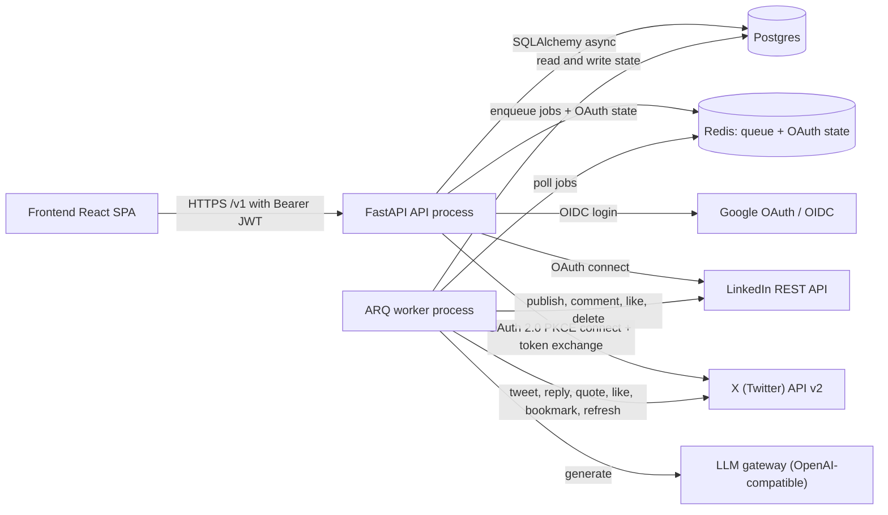
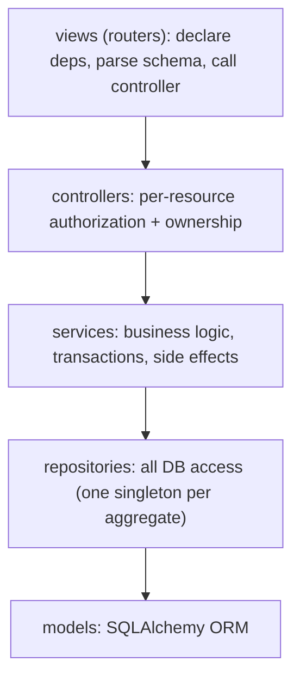
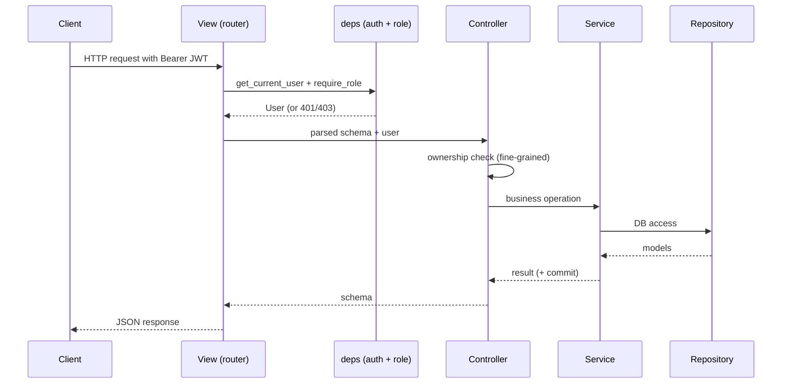
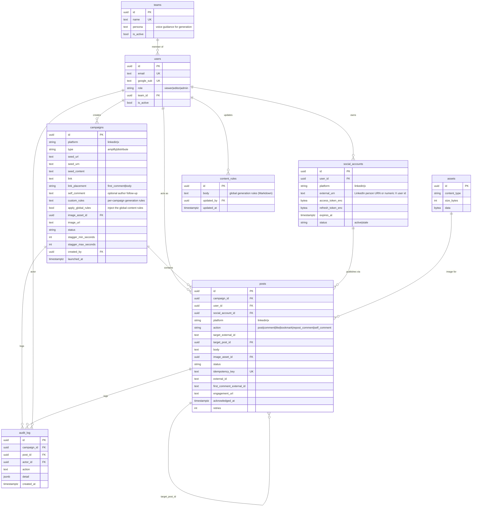
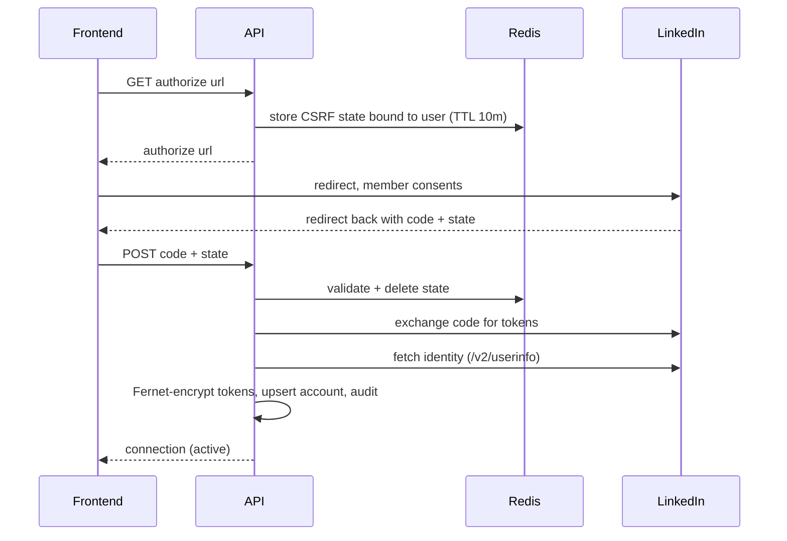
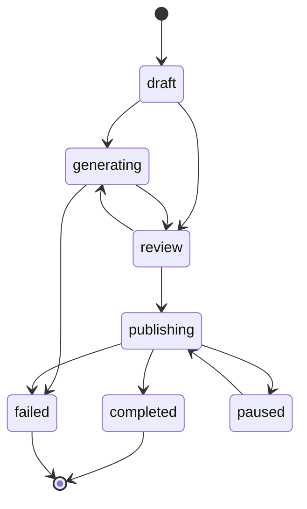
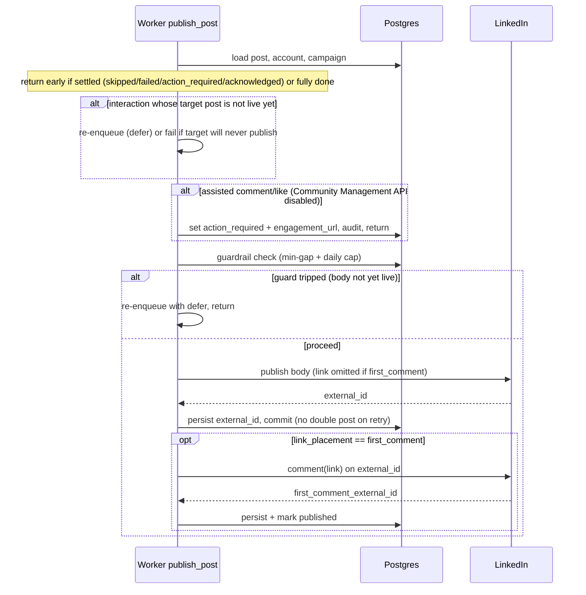

# Architecture

This document describes the super-hype backend as it stands today: the runtime
topology, the layered code structure, the data model, the auth and connection
flows, the campaign lifecycle, the generation subsystem, and the ARQ publishing
pipeline (including the link-in-first-comment sequence and the authenticity
guardrails). It is meant to be a single, accurate reference for onboarding and
for building future presentations.

This is the single authoritative reference for the system. It reflects the code
as written; where a comment or older note disagrees, this document wins.

## 1. Overview

super-hype is an internal employee-advocacy tool. Employees connect their own
LinkedIn and/or X account, then a small GTM team runs coordinated, consented
pushes around a post. A campaign targets exactly one platform (`campaigns.platform`
is `linkedin` or `x`); there is no cross-posting. The platform is chosen at
creation and drives which connection each participant needs, the generation
constraints (X enforces a 280-character budget), and the action vocabulary (on X
a comment is a reply, a reshare is a quote post, and every like is paired with a
bookmark). There are two campaign types:

- Amplify (1 x N): run interactions on one existing post. Every chosen
  participant does all three actions: like, comment, and reshare (on X: like +
  bookmark, reply, and quote post).
- Distribute (N x N): take one seed and give every participant a distinct on-voice
  post to publish, then have everyone like and comment on everyone else's post
  (no reshares), with an optional author self-comment. Cross-engagement is capped
  per member (`DISTRIBUTE_MAX_ENGAGEMENT_TARGETS`) and prioritizes founder-team
  posts so a large campaign does not fan out quadratically.

Platform behavior differs in one important way. On LinkedIn, comments and likes
need the vetted Community Management API, so until it is enabled they run
assisted-manual (the person acts in their own browser and marks it done). On X,
every action is fully automated through the v2 API, so nothing is assisted-manual
there. See `[backend/app/core/engagement.py](backend/app/core/engagement.py)`
(`is_assisted`), which returns false for all X actions.

The plan is not assembled by hand. The portal collects participants (people or
whole teams) and the backend's `expand_participants` turns them into the concrete
per-person actions for the campaign type.

Everything slow or external (LLM generation, publishing, fan-out) runs in an ARQ
worker. The API only validates, persists, and enqueues.

## 2. Runtime topology

Two Python processes share one codebase, one Postgres database, and one Redis
instance. Redis is both the ARQ job queue and the short-lived store for OAuth CSRF
state.



- API entrypoint: `[backend/app/main.py](backend/app/main.py)` builds the FastAPI
  app, runs startup health checks for Postgres and Redis, configures CORS, and
  mounts routers. Interactive docs are enabled outside production only.
- Worker entrypoint: `[backend/app/workers/arq_app.py](backend/app/workers/arq_app.py)`
  registers the job functions and points at Redis. `max_tries = 1`, because each
  job manages its own retries explicitly (defer plus bounded backoff).
- Both processes share the engine and session factory in
  `[backend/app/db/session.py](backend/app/db/session.py)`.

## 3. Layered architecture

The backend follows a strict one-job-per-layer rule. Each layer only calls the
layer directly below it.



- Views are thin. They declare the route and its dependencies (auth, role), parse
  the request body into a schema, call a controller, and return a schema.
- Controllers enforce fine-grained authorization (ownership), on top of the coarse
  role gate declared in the view.
- Services own multi-step logic, transactions, and external side effects.
  Repositories do not commit; the controller or service does.
- Repositories are the only place that touch the database.

Directory map (`backend/app/`):

```
app/
  main.py            FastAPI factory, lifespan health checks, CORS, routers
  config.py          Settings (pydantic-settings); all config from env
  logger.py          structlog setup
  core/
    security.py      JWT create/decode
    deps.py          get_current_user, require_role
    crypto.py        Fernet encrypt/decrypt for tokens
    redis.py         Redis + ARQ redis settings
    safe_fetch.py    SSRF-guarded image fetch
    platforms.py     platform constants + platform_label helper
    linkedin_urn.py  parse a pasted LinkedIn URL into a post URN (keeps the activity/share/ugcPost namespace); expands lnkd.in short links by following redirects, validating every hop against a LinkedIn host allowlist (no SSRF)
    x_urls.py        parse a pasted X post URL (or bare id) into a numeric tweet id, and build a tweet permalink
  db/
    base.py          DeclarativeBase, mixins, naming convention
    session.py       async engine, session factory, get_db
  models/            SQLAlchemy ORM, one module per aggregate
  schemas/           pydantic request/response (the API boundary)
  repositories/      DB access; one singleton repo per aggregate
  services/          business logic + external side effects
  controllers/       per-resource request handling + ownership
  views/             FastAPI routers (thin)
  providers/         base Protocol + linkedin.py + x.py (shared error hierarchy)
  integrations/      llm.py (OpenAI SDK against the gateway)
  prompts/           LLM prompt builders + banned-phrase constants
  storage/           AssetStore Protocol + Postgres bytea backend
  workers/           arq_app.py (WorkerSettings) + jobs.py
```

## 4. Request lifecycle

All resource routes are mounted under `/v1` by
`[backend/app/views/__init__.py](backend/app/views/__init__.py)` and a separate
health router lives at the root.



- Authentication: `get_current_user` in
  `[backend/app/core/deps.py](backend/app/core/deps.py)` extracts the bearer token
  via `HTTPBearer`, decodes it with `decode_access_token`
  (`[backend/app/core/security.py](backend/app/core/security.py)`), loads the user,
  and rejects inactive users.
- Authorization: `require_role(*roles)` is a dependency factory gating on a
  cumulative hierarchy (`viewer` 0, `editor` 1, `admin` 2). This is the coarse
  gate. Controllers add the fine rule, for example a participant acting only on
  their own post or a campaign creator editing only their own campaign.
- The API boundary speaks pydantic schemas, never ORM objects directly.

## 5. Data model

All timestamps are `timestamptz` and the code works in UTC.



Notable points:

- `teams` carries a `persona` (voice guidance). A user's team persona is injected
  into the generation prompts so a distribute campaign reads in each participant's
  team voice rather than one uniform tone. Teams are seeded (see `app/seed.py`) and
  membership on `users.team_id` drives onboarding and the founder-first ordering of
  distribute cross-engagement. Team selection does not change a user's role;
  everyone joins as a viewer and an admin grants editor via `PATCH /v1/users/{id}`.
- `content_rules` is a singleton document (one row) holding the admin-editable
  global generation rules. Its `body` (Markdown) is injected into every campaign's
  generation prompts. Combined per campaign with `campaigns.custom_rules` and gated
  by `campaigns.apply_global_rules`; see section 8. Edited only by admins through
  `GET`/`PUT /v1/content-rules`.
- `posts.action` is one of `post`, `comment`, `like`, `bookmark`,
  `repost_comment`, or `self_comment`. A `self_comment` is the author's own
  follow-up ("link in the comments") on their own post: it is a tracked row
  targeting the poster row (via `target_post_id`), so it is visible in the plan
  and, when the socialActions API is unavailable, falls back to the same
  assisted-manual step as comments and likes instead of failing silently.
  `bookmark` exists only on X campaigns, where the planner pairs a bookmark with
  each like so a supporter both likes and saves the target (both are strong
  ranking signals in X's algorithm).
- `campaigns.platform` and `posts.platform` record which platform the row runs
  on (`linkedin` or `x`), defaulting to `linkedin` for backward compatibility.
  The worker routes each post to the matching provider by `posts.platform`, and
  approval readiness checks the participant's account for `campaigns.platform`.
- `social_accounts` holds Fernet-encrypted `access_token_enc` and
  `refresh_token_enc`, plus `expires_at` and a `status` of `active` or `stale`.
  Unique on `(user_id, platform)`. See
  `[backend/app/models/social_account.py](backend/app/models/social_account.py)`.
- `posts` is the unit of work: one action for one person. For amplify, the target
  is `target_external_id` (the pasted post URN). For distribute interactions,
  `target_post_id` links to the local variation post, whose `external_id` resolves
  to the live URN once it publishes. `idempotency_key` is unique so a retry never
  double-posts, and `first_comment_external_id` records the link comment and
  doubles as the resume marker. See
  `[backend/app/models/post.py](backend/app/models/post.py)`.
- `assets` keeps image bytes out of the hot tables; the `data` column is TOASTed
  out-of-line and only read to serve a preview or upload to LinkedIn.
- `audit_log` is append-only, written on every externally triggered mutation, and
  indexed on `(campaign_id, created_at)` for the timeline view.
- Pagination uses keyset on `(created_at, id)`; the supporting indexes are declared
  on the models.

## 6. Auth and connections

### Google login to JWT

`[backend/app/controllers/auth_controller.py](backend/app/controllers/auth_controller.py)`
completes a Google OIDC login: it rejects any email outside
`COMPANY_EMAIL_DOMAIN`, upserts the user (assigning `admin` if the email is in
`BOOTSTRAP_ADMIN_EMAILS`, otherwise `viewer`), and mints a JWT carrying
`user_id`, `email`, and `role`. There is no trial or subscription logic; this is
an internal tool.

### LinkedIn connect, reconnect, disconnect

`[backend/app/controllers/connection_controller.py](backend/app/controllers/connection_controller.py)`
plus `[backend/app/services/linkedin_oauth_service.py](backend/app/services/linkedin_oauth_service.py)`:



- CSRF state is stored in Redis bound to the user, with no cookie session, and is
  validated and deleted on callback.
- Tokens are Fernet-encrypted via
  `[backend/app/core/crypto.py](backend/app/core/crypto.py)` before they touch the
  database. Plaintext tokens are never stored or logged.
- Scopes are `w_member_social openid profile` only. Identity comes from OIDC
  `/v2/userinfo` (the `sub` claim becomes `urn:li:person:{sub}`).
- Disconnect best-effort revokes the token, deletes the row, and audits it.

### X connect, reconnect, disconnect

`[backend/app/controllers/connection_controller.py](backend/app/controllers/connection_controller.py)`
plus `[backend/app/services/x_oauth_service.py](backend/app/services/x_oauth_service.py)`
handle X on the same routes as LinkedIn (`/v1/connections/x/*`), with two
differences from the LinkedIn flow:

- OAuth 2.0 PKCE. `authorize_x` generates a code verifier and its S256
  challenge; the verifier is stored in Redis bound to the CSRF state (never sent
  to the browser) and replayed at the code exchange. X is a confidential client,
  so the token endpoint also takes HTTP Basic auth with the client id and secret.
  Scopes are `tweet.read tweet.write users.read like.write bookmark.write
  media.write offline.access`. `external_urn` holds the numeric X user id from
  `/2/users/me`.
- Rotating refresh token. X access tokens live ~2 hours and `offline.access`
  grants a single-use refresh token that rotates on every use. Both are
  Fernet-encrypted at rest. Because the token is short-lived, the worker
  refreshes it proactively (see the next subsection) rather than relying on
  re-consent.

The reconnect-then-act primitive is shared: `authorize_x` accepts a
`resume_post_id` and `complete_x` resumes the approve after storing the fresh
token, exactly like LinkedIn. `_resume_pending_post` only resumes a post whose
`platform` matches the connected account, so an X connect never approves a
LinkedIn post or vice versa. Disconnect best-effort revokes, deletes the row,
and audits it (`x_disconnected`).

### Token lifetime and staleness (current behavior)

- LinkedIn access tokens last 60 days. `exchange_code` stores
  `expires_at = now + expires_in` (defaulting to 60 days).
- Refresh tokens (365 days) are only issued to apps approved for the Marketing
  Developer Platform. A standard Share-on-LinkedIn app receives no refresh token,
  so the member must re-consent roughly every 60 days.
- Re-consent is pre-checked at approve time (reconnect-then-act). Before approving
  a post, `approve_post` checks the owner's account with
  `SocialAccount.needs_reconnect` (stale, expired, or within
  `LINKEDIN_RECONNECT_BUFFER_HOURS` of expiry). If re-consent is needed it returns
  `409 {"code": "linkedin_reconnect_required"}`. The portal then sends the user
  through authorize with a `resume_post_id` bound into the Redis state; on the
  callback, after storing the fresh token, `complete_linkedin` resumes the approve
  (owner-checked, idempotent) and enqueues `publish_post`. So one consent flow both
  reconnects and runs the action. The Slack phase reuses this same primitive.
- The worker keeps the reactive 401 path (mark `stale`, enqueue
  `request_reconnect`) as the safety net for tokens revoked out-of-band between
  approval and publish. On LinkedIn `provider.refresh()` is used only if the app
  holds a refresh token (standard Share-on-LinkedIn apps get none). See section 11.

### X token refresh (worker-side)

X access tokens expire in ~2 hours, so re-consent per publish is not viable.
Instead `publish_post` calls `_ensure_fresh_token` before dispatching: if the
account holds a refresh token and its `expires_at` is within
`_TOKEN_REFRESH_BUFFER_SECONDS` (10 minutes), the worker refreshes and persists
the rotated pair immediately (committed on its own, since X refresh tokens are
single-use and must survive even if the publish that follows rolls back).

- One approval fans out into several concurrent `publish_post` jobs for the same
  account (post, like, bookmark, reply, quote), so the refresh is serialized with
  a per-account Redis lock (`super-hype:token-refresh:{account_id}`). Losers wait
  for the winner, re-read the row, and skip the refresh if the token is fresh
  again, so the single-use refresh token is never burned twice.
- A dead or already-rotated refresh token comes back from the X token endpoint as
  HTTP 400 `invalid_grant` (per RFC 6749), which the provider maps to
  `ProviderAuthError`, so the worker marks the account `stale` and enqueues a
  reconnect exactly as it does for a 401. `SocialAccount.requires_reconnect`
  returns false while a live refresh token is present (the worker keeps the token
  alive), and reconnection is prompted only once the account is marked stale.

## 7. Campaign lifecycle

`[backend/app/services/campaign_service.py](backend/app/services/campaign_service.py)`
owns the status state machine and the plan builder. There is no `approved` state:
launch is gated per participant (each person approves their own post), not by an
admin sign-off.



- `transition` validates the move against the `TRANSITIONS` table and writes an
  audit row.
- `expand_participants` turns the chosen participant ids into the concrete
  assignment set for the campaign type: for amplify, every participant gets a like,
  a comment, and a reshare against the seed post; for distribute, every participant
  gets a post plus a like and a comment on every other participant's post (capped
  and founder-first), and an author self-comment if the campaign has one. There is
  no manual per-row assignment; the portal only picks people or teams.
- `build_plan` turns that assignment set into post rows. For amplify it creates
  interaction rows against the seed URN. For distribute it creates `post`
  (variation) rows, interaction rows linked by `target_post_id`, and one
  `self_comment` row per authored post when `campaign.self_comment` is set. Posters
  are grouped by team persona so the model drafts variations in the right voice.
  Each row gets a unique idempotency key. A rebuild replaces only `pending` rows,
  so approved work awaiting publish (`scheduled`), published, failed, or skipped
  posts survive editing the plan. The portal edits a plan through the two-step
  campaign wizard (`/app/campaigns/:id/edit`); the read-only campaign view does not
  show it.
- `check_completion` moves a `publishing` campaign to `completed` once every post
  is terminal.
- Pause and resume: a launched campaign can be paused (`publishing -> paused`) and
  resumed (`paused -> publishing`). The worker jobs no-op while a campaign is
  `paused`, so deferred publishes and DMs stop; resume re-enqueues the outstanding
  work. Restricted to the creator or an admin.
- Reset: `reset_for_rerun` is an admin override outside the `TRANSITIONS` matrix
  that rewinds a launched campaign from any state (publishing, paused, completed,
  failed) back to `review`, wiping each post's publish artifacts while keeping the
  plan. Because the campaign is back in `review`, the worker guards drop any jobs
  still deferred from the previous run, and the reset endpoint also enqueues
  `flush_campaign_jobs` to clear them from the queue, so nothing stale fires on the
  next launch. Restricted to the creator or an admin.
- `delete_campaign` removes a campaign along with its posts and audit rows; the FKs
  carry no ON DELETE rule, so the children are cleared first and a final
  `campaign_deleted` audit row is written with a null campaign_id. A plain creator
  can only delete an un-launched campaign (`draft`, `review`, or `failed`); an admin
  may delete in any state (cleanup, pilot resets). Deletion also cancels any
  still-queued jobs so nothing stale fires.

RBAC for campaigns: amplify create, launch, and generate are open to any role;
distribute create and generate require editor or above. The fine ownership rules
live in `[backend/app/controllers/campaign_controller.py](backend/app/controllers/campaign_controller.py)`
and `[backend/app/controllers/post_controller.py](backend/app/controllers/post_controller.py)`.

## 8. Generation subsystem

Generation runs through the LLM gateway using the OpenAI SDK, never the Anthropic
SDK, and never a hardcoded model name.

- `[backend/app/integrations/llm.py](backend/app/integrations/llm.py)` returns an
  `AsyncOpenAI` client pointed at `LLM_GATEWAY_URL` with `LLM_API_KEY`.
- `[backend/app/prompts/generation.py](backend/app/prompts/generation.py)` holds the
  prompt builders (`variations_system`, `interactions_system`, `_hint_block`) and
  the `BANNED_PHRASES` and `BANNED_COMMENT_OPENERS` constants. Prompt text lives
  here; the service owns orchestration. The craft rules (hook first, opinion over
  announcement, specificity, human voice, a reason to engage, no buzzwords) were
  salvaged from the retired writing-skill feature.
- `[backend/app/services/generation_service.py](backend/app/services/generation_service.py)`
  calls the gateway with `response_format=json_object`, strips code fences, parses
  JSON, and validates against the small pydantic contracts in
  `[backend/app/schemas/generation.py](backend/app/schemas/generation.py)`
  (`VariationSet`, `InteractionTexts`). Malformed output raises `GenerationError`,
  which fails the generation job rather than publishing garbage.
- Comment-quality floor: generated non-like interactions must clear
  `MIN_COMMENT_WORDS` and avoid generic praise and banned buzzwords. The service
  regenerates once, then raises `GenerationError`. This keeps a coordinated push
  from reading as a bot pod.
- `like` items never call the LLM (a like has no text).
- Persona: each poster's team `persona` is passed into `variations_system` so a
  distribute campaign's variations read in that team's voice. Free-form persona
  text is whitespace-collapsed before it is embedded so it cannot break prompt
  parsing.
- Tone and length hints govern distribute variation bodies and reshare commentary
  (`repost_comment`) only. Comments are written from the pasted post content and
  ignore the tone/length presets, so they read as genuine reactions.
- Content rules: `build_plan` composes the effective rules once per generation via
  `_effective_rules` and threads them into both `generate_variations` and
  `generate_interactions` as the prompt `extra`. The order is the global
  `content_rules` body (unless `campaigns.apply_global_rules` is false), then the
  campaign's `custom_rules`, each under a labeled header. Empty rules resolve to no
  extra text, so a fresh install with no global rules generates exactly as before.

## 9. Worker and publishing pipeline

`[backend/app/workers/jobs.py](backend/app/workers/jobs.py)` defines six ARQ jobs:

- `generate_drafts`: builds the plan with LLM fill; on `GenerationError` it moves
  the campaign to `failed` and audits it.
- `launch_campaign`: transitions the campaign to `publishing` and fans out one
  `notify_participant` job per participant (grouping the campaign's pending posts by
  owner, so each person gets one bundled ask, not one per post), each deferred by a
  random delay drawn from `[stagger_min_seconds, stagger_max_seconds]`. It then
  enqueues `send_reminders`, deferred by `REMINDER_DELAY_SECONDS`.
- `notify_participant`: marks all of one person's pending posts `scheduled`
  together and, when Slack is configured, DMs them a single Block Kit card listing
  every action with Approve all / Skip all. Slack is additive: the scheduling
  happens with or without it, so the portal flow is unchanged when Slack is off.
- `notify_engagements`: DMs a person the bundled assisted engagements (comment,
  like, self-comment) that are awaiting their hand, each with a deep link and the
  suggested text, under one Mark all done / Skip all control. Enqueued from
  `publish_post` when an assisted ask goes `action_required`, deduped on a
  per-person job id (`engage:{campaign}:{user}`) and deferred by
  `ENGAGEMENT_BUNDLE_DELAY_SECONDS` so a person's like and comment collapse into a
  single card rather than a DM per ask.
- `publish_post`: the core publish job (detailed below).
- `send_reminders`: re-DMs anyone still outstanding, bucketed per person: the
  approve/skip bundle for posts still `scheduled`, the mark-all-done bundle for
  assisted asks still `action_required`. Fully-settled people get nothing. A no-op
  without Slack (the portal always carries the same work).
- `request_reconnect`: DMs the owner of a stale account (LinkedIn or X) a
  reconnect link. Enqueued when publishing hits a 401, or when an X refresh token
  is dead (400 `invalid_grant`), and the account is marked `stale`.
- `handle_slack_interaction`: runs a signature-verified Slack button click
  (approval work plus the card update via `response_url`) off the request path,
  so the endpoint acks inside Slack's 3s window and does no external call inline.

Approvals: the approve, acknowledge, and skip logic lives in
`[services/approval_service.py](backend/app/services/approval_service.py)`, shared
by the HTTP `post_controller` and the Slack controller so the ownership guards,
state checks, and side effects (audit rows, completion, publish enqueue) live in
one place. It raises transport-agnostic `ApprovalError` subclasses; each caller
maps them to an HTTP response or a Slack card. When a person approves their own
post, an individual `publish_post` job is enqueued. Launch is compulsory, so
approval is rejected (409) until the campaign is launched
(`campaigns.launched_at` is set).
Before launch only plan edits are allowed; nothing reaches the publish queue. The
portal hides the per-post Approve and Skip buttons until launch and surfaces a
hint, and renders the `publishing` status as "Active".

Assisted-manual engagement: comments, likes, and author self-comments need the
`w_member_social_feed` scope (Community Management API), which is not self-serve.
While `COMMUNITY_MANAGEMENT_ENABLED` is false (the default), `publish_post` does
not call the API for a `comment`, `like`, or `self_comment`. Once the target is
live it resolves the post permalink (`build_post_permalink`), sets the post to
`action_required`, and stores `engagement_url` (plus the suggested text for a
comment or self-comment). The owner opens the post, acts by hand, and calls
`POST /v1/posts/{id}/ack` (owner-only) to move it to `acknowledged`
(`acknowledged_at` set). Both `action_required` and `acknowledged` count as
settled for campaign completion, so a campaign does not hang waiting on a human.
A self-comment additionally waits until its parent post is live before it becomes
actionable, since you cannot comment on a post that does not exist yet. The ask
payload is factored into `services/engagement_service.py` so a Slack card can
reuse it later. Posts and reshares stay fully automated; flip the flag to true to
dispatch comments, likes, and self-comments through the API with no code change.

This assisted-manual path is LinkedIn-only. `is_assisted(action, platform)`
returns false for every X action, so X comments, likes, and bookmarks always
dispatch through the v2 API regardless of `COMMUNITY_MANAGEMENT_ENABLED` (which
gates the LinkedIn socialActions scope, not X).

Combined like + comment: because an assisted like and comment on the same target
both just send the person to LinkedIn, the portal merges them into one card so
they open the post once, like it, paste the comment, and settle both together.
`PostOut.assisted` (computed from `is_assisted`) tells the client which rows are
assisted; the frontend groups the like + comment for one actor + target (and only
when both share a status) and drives one Approve, Mark done, or Skip through
`POST /v1/posts/batch` (`{ op, post_ids }`), which settles every listed post in a
single atomic transaction. The two rows stay distinct in the database so the
leaderboard still scores like and comment separately. The endpoint takes an
arbitrary id list on purpose: once the Community Management API is enabled, the
same batch approve can fire a person's full action set at once with no backend
change.

### publish_post

`publish_post` is idempotent, dependency-aware, guardrailed, and supports the
all-or-nothing link-in-first-comment sequence with rollback.



Key properties:

- Idempotent: a fully done post is a no-op. The body's `external_id` is committed
  before the first comment is attempted, so a retry never re-publishes the body. A
  retry between the two steps resumes at the comment.
- Dependency-aware: an interaction self-defers until its target post is live, and
  fails fast if the target reaches a terminal non-published state.
- Authenticity guardrails (`_guardrail_defer`): before an outbound action whose
  body is not yet live, the worker checks a per-account minimum spacing
  (`MIN_SECONDS_BETWEEN_ACCOUNT_ACTIONS`) and a per-account daily cap
  (`MAX_ACTIONS_PER_ACCOUNT_PER_DAY`), backed by
  `post_repo.published_times_for_account`. If a guard trips it defers (re-enqueues)
  rather than skips, so the action still happens later. The first-comment resume
  step is exempt.
- Link-in-first-comment: with `link_placement == "first_comment"`, the body is
  published without the link and the link is placed as the first comment for reach.
  This is all-or-nothing: if the comment permanently fails, the post is rolled back
  with `provider.delete_post` and marked failed, so we never leave a live post
  without its link. With `link_placement == "body"`, the link goes in the
  commentary and there is no separate comment step.
- Error handling: a 401 marks the account `stale` and enqueues `request_reconnect`
  (non-retryable). A 429 re-enqueues after `retry_after`. Other errors use bounded
  exponential backoff up to `MAX_RETRIES`, then mark the post failed (rolling back
  a partial first-comment publish first).
- Every publish, first-comment placement, and rollback writes an audit row.

Providers implement one shared Protocol and a shared error hierarchy
(`ProviderAPIError`, `ProviderAuthError`, `ProviderRateLimitError` in
`[backend/app/providers/base.py](backend/app/providers/base.py)`), so the
worker's retry policy (auth -> reconnect, 429 -> delayed retry, other 4xx ->
fail fast) is written once and works for every platform. `publish_post` picks
the provider by `posts.platform` through the `_provider(platform)` registry in
`[backend/app/workers/jobs.py](backend/app/workers/jobs.py)` (unknown platforms
fall back to LinkedIn rather than crashing the worker).

- `[backend/app/providers/linkedin.py](backend/app/providers/linkedin.py)` talks
  to the versioned `/rest/posts` API with the `LinkedIn-Version` and
  `X-Restli-Protocol-Version` headers, plus `comment`, `like`, reshare,
  three-step image upload, `delete_post`, and `refresh`. LinkedIn has no
  bookmark, so `bookmark` raises (the planner never creates bookmark rows for
  LinkedIn).
- `[backend/app/providers/x.py](backend/app/providers/x.py)` talks to the X v2
  API: `publish` (tweet), `reshare` (quote post), `comment` (reply), `like`,
  `bookmark`, chunked media upload, `delete_post`, `refresh` (rotating token),
  and `insights` (public metrics). It maps 401 to `ProviderAuthError`, 429 to
  `ProviderRateLimitError`, and the token endpoint's 400 `invalid_grant` to
  `ProviderAuthError`.

## 10. Cross-cutting concerns

- Token encryption: LinkedIn and X access and refresh tokens are Fernet-encrypted
  at rest via `core/crypto.py`. Tokens are never logged.
- SSRF protection: external image URLs are fetched through
  `[backend/app/core/safe_fetch.py](backend/app/core/safe_fetch.py)`, which blocks
  non-public hosts, caps the byte size, and validates the content type. The
  lnkd.in short-link expansion in `core/linkedin_urn.py` follows redirects
  manually and checks every hop against a fixed LinkedIn host allowlist, so a
  crafted short link cannot be used to reach an internal or arbitrary address.
- RBAC: coarse `require_role` in views plus fine ownership in controllers.
- Audit logging: every externally triggered mutation appends to `audit_log`.
- Asset serving hardening: `GET /v1/assets/{id}` sets `X-Content-Type-Options:
  nosniff`.
- Secrets and config: all config comes from the environment via pydantic-settings
  (`[backend/app/config.py](backend/app/config.py)`); secrets are never committed.
- Logging: structlog throughout, with redaction of anything token-like in error
  summaries.
- Startup safety: the API refuses to start in production with a default JWT secret
  and verifies Postgres and Redis reachability before serving.
- Leaderboard: `services/leaderboard_service.py` ranks members by a weighted score
  of the actions super-hype actually recorded (like 1, comment 3, repost 5) plus a
  brand-mention bonus for direct posts (10 for text, 30 with media), over an
  optional date window. There is no member-post metrics API on LinkedIn, so the
  impressions term stays 0 and is kept only as a seam for a future analytics source.

## 11. Slack bundled approval

Slack removes the friction of approving from the portal. Each participant is DMed
in bundles, one click per stage:

- At launch, one card bundles every action they own in the campaign (self post,
  reshare, comment, like, self-comment) behind a single Approve all / Skip all.
- As their assisted asks (comment, like, self-comment) become actionable once
  their targets publish, a second card bundles them behind Mark all done / Skip
  all, each ask carrying a deep link to the post and the suggested comment text.
  This card is what closes the loop on the manual engagement step: approving does
  not do the like or comment, so the person still acts on LinkedIn and marks it
  done, all from one message.
- A deferred reminder (`send_reminders`) re-DMs anyone still not approved or not
  done, and a stale token triggers a reconnect DM (`request_reconnect`).

This is the near-term answer to "one approval for everything a person has to do",
and it generalizes: the bundles become a full "approve all my actions" the day the
Community Management API lands and comments and likes stop being assisted-manual.

Pieces:

- `[integrations/slack.py](backend/app/integrations/slack.py)`: a thin async Web API
  client (`users.lookupByEmail`, `conversations.open`, `chat.postMessage`, and a
  reply to an interaction's `response_url`) plus `verify_signature`, an
  HMAC-SHA256 check over the raw request body with a five-minute replay window. The
  client is transport-injectable so tests stub every call. `build_slack_client`
  returns `None` when no bot token is set, which is how every caller degrades
  gracefully.
- `[models/slack_identity.py](backend/app/models/slack_identity.py)` +
  `[repositories/slack_identity_repo.py](backend/app/repositories/slack_identity_repo.py)`:
  cache the app-user to Slack-user mapping (and DM channel), keyed by `user_id` and
  looked up by `slack_user_id` on an inbound click. Resolved once via email lookup,
  then reused.
- `[services/slack_service.py](backend/app/services/slack_service.py)`:
  `notify_participant` builds and sends the launch-time approve/skip card;
  `notify_engagements` builds the assisted mark-all-done card (each ask with its
  deep link and suggested text); `notify_reconnect` DMs a stale-token owner a
  reconnect link. `handle_interaction` maps the clicker back to an app user,
  gathers their actionable posts in the campaign, and runs them through
  `approval_service.batch` (the same path the portal uses), then replaces the card
  with the outcome. One dispatch table maps each button (`campaign_approve_all`,
  `campaign_skip_all`, `engagement_ack_all`, `engagement_skip_all`) to an approval
  op and the post states it gathers. A reconnect-required approval answers with a
  portal reconnect link instead of settling anything.
- `[views/slack.py](backend/app/views/slack.py)` +
  `[controllers/slack_controller.py](backend/app/controllers/slack_controller.py)`:
  `POST /v1/slack/interactions` reads the raw body, verifies the signature (401 on
  failure, 503 when Slack is unconfigured), parses the form-encoded `payload`, and
  enqueues the `handle_slack_interaction` job, then acks with an empty 200. The
  approval work and the outbound card update run in the worker, never in the
  request, so Slack's 3s ack window is never at risk and no external call happens
  in the request path.

Because approvals route through the shared `approval_service`, every guard (owner
only, launch required, valid state, reconnect gate, one campaign per batch) applies
identically whether the click came from the browser or from Slack.

## 12. Known gaps and future work

- Reconnect-then-act (implemented for the portal). The portal pre-checks expiry at
  approve time and bundles re-consent with the action via a `resume_post_id` bound
  into the OAuth state. Silent pre-flight refresh is now implemented for X (the
  worker's `_ensure_fresh_token` refreshes near-expiry tokens); it activates for
  LinkedIn automatically if the app ever holds a refresh token. Remaining work:
  wire the Slack reconnect button (the resume primitive already exists).
- Timezone-aware scheduled launches. There is no scheduled start today; launch is
  immediate and only the per-person stagger is delayed. Recommended: store UTC and
  render local. Add `campaigns.scheduled_at` (`timestamptz`, UTC) and an IANA
  `campaigns.timezone` (for example `Asia/Kolkata`, `America/Los_Angeles`,
  `America/New_York`). The frontend collects local wall-clock time plus the zone,
  converts to UTC, and sends UTC; the worker schedules with ARQ `_defer_until`. Do
  not pin a single fixed offset like IST, since cross-timezone teams and DST shifts
  make fixed offsets wrong.
- Slack is fully wired (see section 11): bundled approve/skip at launch, the
  assisted mark-all-done bundle, deferred `send_reminders`, and `request_reconnect`
  on a stale token. Missing only a recurring scheduler, so `send_reminders` fires
  once per launch (deferred by `REMINDER_DELAY_SECONDS`) rather than on a cadence;
  a cron/`cron_jobs` sweep would let it nudge repeatedly.
- Expiry-sweep cron. A daily sweep over `social_accounts.expires_at` to refresh or
  prompt reconnect is deferred (the supporting index already exists).
- Insights. `provider.insights` is implemented for X (public metrics via
  `/2/tweets/{id}`) but not yet consumed by the leaderboard; LinkedIn insights
  remain unimplemented (no member-post metrics API on the `w_member_social`
  scope).
- Amplify post text. Generation needs the target post's text to write relevant
  comments, but we only store the URN and cannot read arbitrary post bodies with
  the `w_member_social` scope (`GET /rest/posts/{urn}` needs the restricted
  `r_member_social`). For now the user pastes the post text into `seed_content`. A
  future best-effort fetch from the public embed page
  (`/embed/feed/update/urn:li:share:{id}`) via `safe_fetch` could prefill it, with
  manual paste as the fallback.
